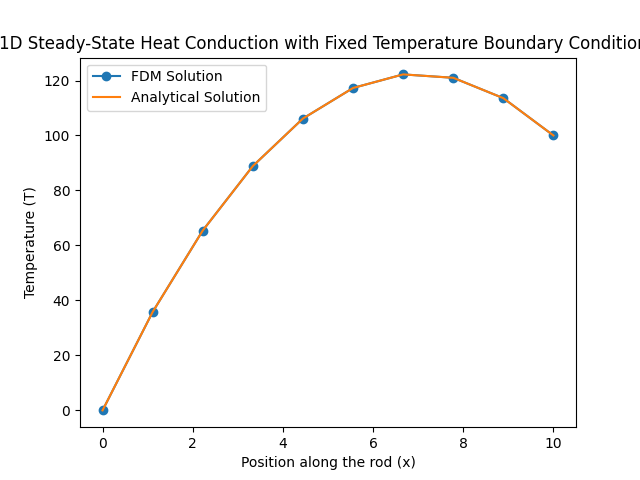
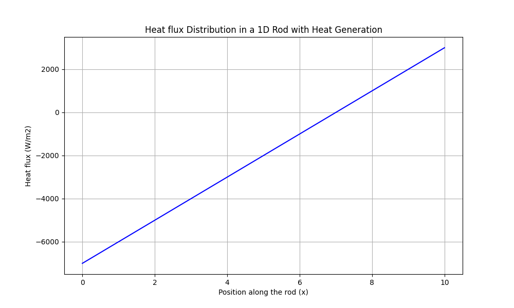
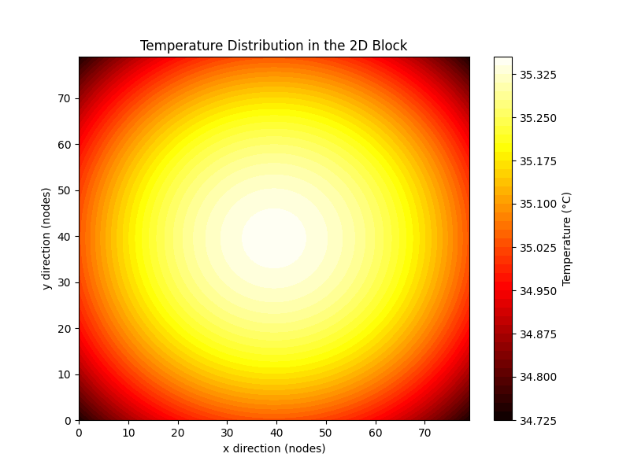
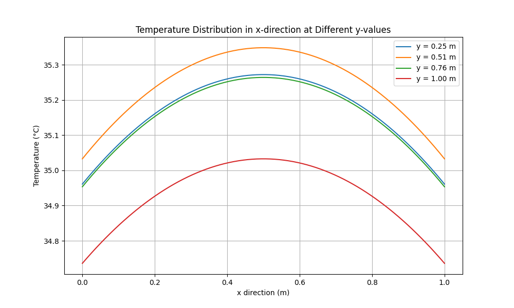
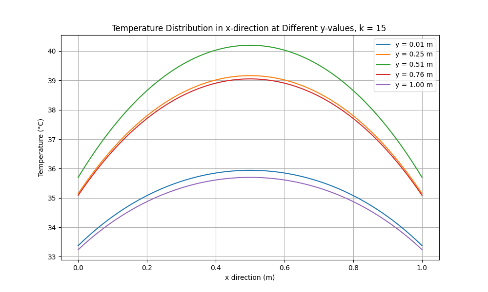
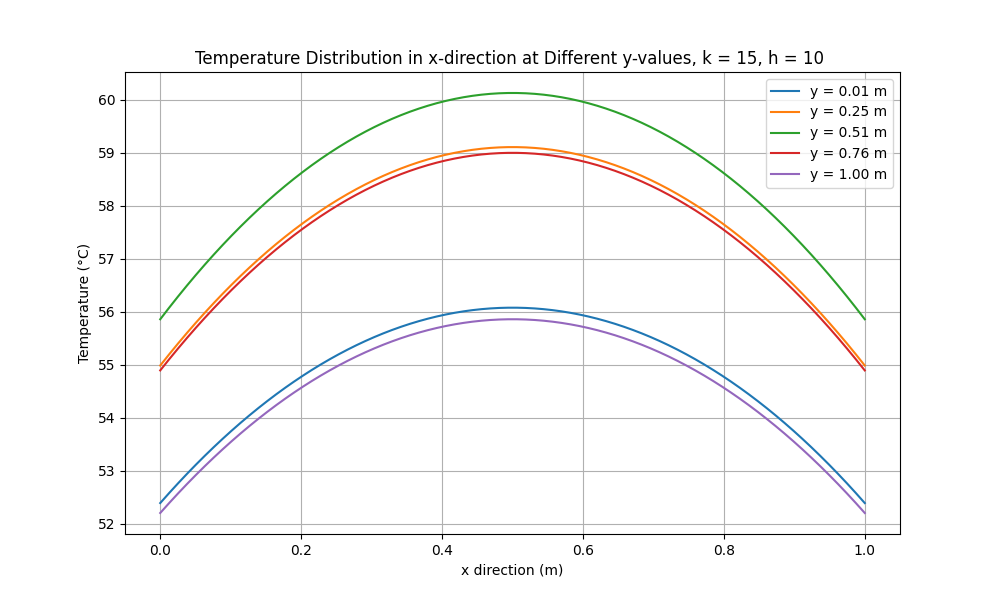

# 1D Heat Conduction Problem: Finite Difference Method (FDM) vs. Analytical Solution

## Overview

This project demonstrates the solution of a 1D and 2D steady-state heat conduction problem using the Finite Difference Method (FDM).  The files can be found as 1d_heat_transfer.py and 2d_heat_transfer.py in this repo.
## Problem Description
You have a metal rod of length L=10 m. The rod is subjected to internal heat generation due to an electrical heating element. The rod's temperature at its ends is kept at fixed temperatures. The thermal conductivity of the rod is k=200 W/mK, and the internal heat generation rate per unit volume is q=1000 W/m3. The boundary conditions are:

    The temperature at the left end of the rod (x=0) is fixed at 0 degrees.
    The temperature at the right end of the rod (x=10) is fixed at 100 degrees.

We will find the solution numerically using FDM algorithm, and then verify it. This is especially important for cases where analytical solutions may not be available to compare with.

## Governing Equation
The generalized 3D heat conduction equation with internal heat generation is given by:

$$
\frac{\partial T(x,y,z,t)}{\partial t} = \alpha \left( \frac{\partial^2 T(x,y,z,t)}{\partial x^2} + \frac{\partial^2 T(x,y,z,t)}{\partial y^2} + \frac{\partial^2 T(x,y,z,t)}{\partial z^2} \right) + \frac{q}{\rho c_p}
$$

where:
- $T(x, y, z, t)$ is the temperature as a function of position $(x, y, z)$ and time $t$,
- $\alpha = \frac{k}{\rho c_p}$ is the thermal diffusivity,
- $k$ is the thermal conductivity,
- $\rho$ is the density,
- $c_p$ is the specific heat capacity,
- $q$ is the internal heat generation per unit volume.

We assume only mode of heat transfer is conduction and there is no heat loss from convection/radiation.

The steady-state heat conduction in 1D, with heat generation is governed by the following differential equation:

$$
-\frac{d^2 T(x)}{dx^2} = \frac{q}{k}
$$

(intutively heat generated should be conducted away)
## Analytical solution

Analytical solution is well know and given as: 
$$
T(x) = \frac{T_L - T_0}{L} x + T_0 - \frac{q}{2k} x^2 + \frac{qLx}{2k}
$$

## Solving using Finite difference method
### Methodology

1. **Discretization:** Divide the rod into  n  equally spaced nodes. The distance between adjacent nodes is $\Delta x = \frac{L}{n-1} $
2. **Finite Difference Approximation:** The equation

$$
-\frac{d^2 T(x)}{dx^2} = \frac{q}{k}
$$
can be written as
$$
T_{i-1} - 2T_i + T_{i+1} = -\frac{q (\Delta x)^2}{k}
$$
3. **Linear System Formation:** The following equations can be summarised into a set of linear equations of the form AT = B. Additionally boundary conditions need to be incorporated, apart from the FDM equation obtained above.
4. **Solve the System:** Solve the linear system to obtain the temperature distribution at each node.

$$
\mathbf{A} \mathbf{T} = \mathbf{B}
$$

where

$$
\mathbf{A} =
\begin{bmatrix}
1 & 1 & 0 & \cdots & 0 \\
1 & -2 & 1 & \cdots & 0 \\
0 & 1 & -2 & \cdots & 0 \\
\vdots & \vdots & \vdots & \ddots & \vdots \\
0 & 0 & 0 & \cdots & 1 \\
\end{bmatrix}
$$

$$
\mathbf{B} =
\begin{bmatrix}
T_0 \\
-\frac{q (\Delta x)^2}{k} \\
-\frac{q (\Delta x)^2}{k} \\
\vdots \\
-\frac{q (\Delta x)^2}{k} \\
T_{\text{L}} \\
\end{bmatrix}
$$

$$
\mathbf{T} =
\begin{bmatrix}
T_1 \\
T_2 \\
T_3 \\
\vdots \\
T_{n-1} \\
\end{bmatrix}
$$
This is solved using np.linalg.solve solver in Python available for solving standard linear systems.
4. **Verify the solution** Perform sanity checks on the obtained solution to ensure computed solution is correct.

4.1 **Compare with analytical solution**

4.2 **Check for energy conservation**
Total heat generated shall be equal to heat being conducted away at the end of the rod. This can be represented as 
$$
q_{\text{gen}} \cdot L = k \cdot \left. \frac{dT}{dx} \right|_{x=0}-k \cdot \left. \frac{dT}{dx} \right|_{x=L}
$$

Heat transfer in x direction at various positions on the rod can be represented as

Since heat flux is a vector, the net heat flowing out at \( x = 0 \) is 7000 W and at \( x = 10 \) is 3000 W. The total heat out is 10000 W, which matches the heat generated calculated as 1000*10 = 10000W.

This verifies that our calculations are consistent with the conservation of energy.

Hence our numerical solution is sane.

# 2D Heat Conduction Problem: Finite Difference Method (FDM)

## Problem Description
We have a 1x1 block of very high thickness value, such that variations in z direction can be ignored. The thermal conductivity of the rod is k=200 W/mK, and the internal heat generation rate per unit volume is q=1000 W/m3, ambient temperature is 30 $^\circ\text{C}$, convective heat transfer rate is 50W/m2K. Find the temperature profile in the block.

Summary of conditions

- Thermal conductivity of the block: $k = 200 \, \text{W/mK}$
- Internal heat generation rate per unit volume: $q = 1000 \, \text{W/m}^3$
- Ambient temperature: $T_\infty$ = 30 $^\circ\text{C}$
- Convective heat transfer coefficient: $h = 50 \, \text{W/m}^2\text{K}$
- Block dimensions: $1 \times 1 \, \text{m}$ (with very high thickness, so variations in the z direction can be ignored)
- Steady state

## Final Governing Equations for 2D heat transfer
$$
\frac{\partial^2 T(x,y)}{\partial x^2} + \frac{\partial^2 T(x,y)}{\partial y^2} + \frac{q}{k} = 0
$$
**FDM equations derived from this can be written as:**
The Finite Difference Method (FDM) equation for the 2D steady-state heat conduction with heat generation is:

**Discretization in the \(x\)-direction:**

$$
\frac{\partial^2 T(x,y)}{\partial x^2} \approx \frac{T_{i+1,j} - 2T_{i,j} + T_{i-1,j}}{\Delta x^2}
$$

**Discretization in the \(y\)-direction:**

$$
\frac{\partial^2 T(x,y)}{\partial y^2} \approx \frac{T_{i,j+1} - 2T_{i,j} + T_{i,j-1}}{\Delta y^2}
$$

**Finite Difference Equation:**

$$
\frac{T_{i+1,j} - 2T_{i,j} + T_{i-1,j}}{\Delta x^2} + \frac{T_{i,j+1} - 2T_{i,j} + T_{i,j-1}}{\Delta y^2} + \frac{q}{k} = 0
$$

**Rearranged Finite Difference Equation:**

$$
-\left(\frac{1}{\Delta x^2}\right) T_{i-1,j} - \left(\frac{1}{\Delta y^2}\right) T_{i,j-1} + \left(2\left(\frac{1}{\Delta x^2} + \frac{1}{\Delta y^2}\right)\right) T_{i,j} - \left(\frac{1}{\Delta x^2}\right) T_{i+1,j} - \left(\frac{1}{\Delta y^2}\right) T_{i,j+1} = \frac{q}{k}
$$

Additional equations from boundary conditions can be mentioned as: 
### Boundary conditions from Convective Heat Transfer happening at all plate edges

- At x = 0  and x = L_x, $$ -k \frac{\partial T}{\partial x} = h(T - T_\infty) $$ 
- At y = 0 and y = L_y, $$ -k \frac{\partial T}{\partial y} = h(T - T_\infty) $$ 

Here are the FDM equations corresponding to boundary condition equations for the temperature field in a 2D heat conduction problem:

1. **At \( x = 0 \):**
   $$
   T_{i,j} - \frac{k T_{i+1,j}}{k + h \Delta x} = \frac{h \Delta x T_\infty}{k + h \Delta x}
   $$

2. **At \( x = L_x \):**

   $$
   T_{i,j} - \frac{k T_{i-1,j}}{k + h \Delta x} = \frac{h \Delta x T_\infty}{k + h \Delta x}
   $$

3. **At \( y = 0 \):**

   $$
   T_{i,j} - \frac{k T_{i,j+1}}{k + h \Delta y} = \frac{h \Delta y T_\infty}{k + h \Delta y}
   $$

4. **At \( y = L_y \):**

   $$
   T_{i,j} - \frac{k T_{i,j-1}}{k + h \Delta y} = \frac{h \Delta y T_\infty}{k + h \Delta y}
   $$
## Matrix representing Linear equations

### Interior Node

For an interior node at position \((i, j)\), the matrix row \(A[i, :]\) and vector entry \(b[i]\) are:

$$
A_{\text{interior}} = 
\begin{bmatrix}
\cdots & \frac{k}{dx^2} & -2\left(\frac{k}{dx^2} + \frac{k}{dy^2}\right) & \frac{k}{dx^2} & \cdots \\
\cdots & \frac{k}{dy^2} & \frac{k}{dy^2} & \cdots \\
\end{bmatrix}
$$

$$
b_{\text{interior}} = -q
$$

### Boundary Node

For a boundary node at position \((0, j)\) (left boundary), the matrix row \(A[0, :]\) and vector entry \(b[0]\) are:

$$
A_{\text{boundary}} = 
\begin{bmatrix}
1 & -\frac{k}{k + h \cdot dx} & 0 & \cdots \\
\end{bmatrix}
$$

$$
b_{\text{boundary}} = \frac{h \cdot dx \cdot T_\infty}{k + h \cdot dx}
$$
## Solve the system

$$
\mathbf{A} \mathbf{T} = \mathbf{B}
$$

The temperature distribution upon soluton looks like:

## Verification of simulation

The total heat loss from edge through convection should equal the total heat generated.   
Total heat loss through convection from simulation : 998 W
Total heat generated = 1000 * 1 * 1 = 1000 W  
Hence our numerical solution looks sane, and satisfies conservation of energy.  

## PLAYING

Lets play around with simulation results to get better understanding of what is happening.
Lets plot variation in temperature in x direction at different values of y throughout the block:

**OBSERVATIONS**
- The plot is symmetric attributing to symmetric nature of problem
- Maximum temperature achieved is 35 degrees, with minimal variation throughout the block which can be attributed to high conductivity or high convection coefficient value i.e.  (lumped mass model would give us similar value, assuming T to be constant for the entire block)
$$
q \cdot A_{\text{total}} = h \cdot (T - T_{\infty}) \cdot A_{\text{surfaces}}
$$
where  $A_{\text{surfaces}}$ = $1*4$ (for heat loss from four surfaces)     

Solving for T, we get T = 35 $^\circ\text{C}$, which matches close to our simulation value, showing up in the graph above.

- Taking a practical $k = 15 \, \text{W/mK}$ for [steel](https://www.engineeringtoolbox.com/thermal-conductivity-metals-d_858.html), we get the following variation in temperature

- Temperature at edge remains same, since it is decided by convection coefficient. Variation in temperature increases with decrease in conductivity value k.   
- Set $h = 10 \, \text{W/m}^2\text{K}$, and $k = 15 \, \text{W/mK}$

- Temperature distribution in the block remains similar, while edge temperatures are raised, for transfering equivalent amount of heat generated, due to lower convective coefficient value.
